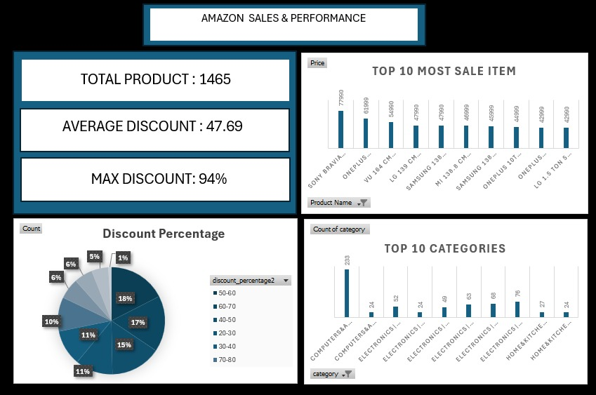

# Amazon-Data-Analysis (Interactive Dashboard creation using MS Excel)

## Project Objective
The objective of this project is to analyze Amazon product sales and discount data using an unclean CSV dataset and transform it into a meaningful interactive dashboard.

## Dataset used
- <a href="https://www.kaggle.com/code/ziad217/amazon-sales">Dataset</a>

## Questions (KPIs)
1. What is the total number of products available in the dataset?
2. What is the average discount percentage offered across all products?
3. What is the maximum discount percentage provided?
4. Which are the Top 10 highest-priced products?
5. Which categories contribute the highest number of products?
6. What is the distribution of products across different discount ranges (0–10%, 10–20%, etc.)?
7. Which discount range contains the highest number of products?

- Dashboard Interaction <a href="https://github.com/Hooke-glitch/Amazon-Data-Analysis/blob/main/amazon_project.jpeg?raw=true" style="max-width: 100%;">View Dashboard</a>

## Process

### 1️⃣ Data Collection

* Imported the unclean Amazon CSV dataset into Excel.
* Reviewed all columns including Product Name, Category, Price, Discount Percentage, Rating, and Rating Count.

---

### 2️⃣ Data Cleaning

* Removed currency symbols (₹) from the Price column.
* Removed percentage symbols (%) from the Discount column.
* Converted Price and Discount columns to numeric format.
* remove 8 columns which are about_product,user_id,user_name,review_id,review_title,review_content,img_link & product_link because its provide no insights.
* Checked and handled missing values.
* Removed duplicate records.
* Standardized column names for easier analysis.

### 3️⃣ Data Transformation

* Generated calculated metrics such as:

  * Average Discount
  * Maximum Discount
  * Total Product Count

### 4️⃣ Data Analysis

* Created Pivot Tables to:
  
  * Count products by category
  * Identify Top 10 highest-priced products
  * Analyze discount distribution
  * Discount percentage groups (0–10%, 10–20%, … 90–100%).
    
* Calculated key performance indicators (KPIs):

  * Total Products: 1,465
  * Average Discount: 47.69%
  * Maximum Discount: 94%
    

### 5️⃣ Dashboard Development

* Designed a dashboard in Excel.
* Added KPI cards for quick insights.
* Included:

  * Bar chart for Top 10 highest-priced products
  * Column chart for Top categories
  * Pie chart for Discount distribution

### 6️⃣ Insight Generation

* Analyzed pricing and discount strategy.
* Identified dominant categories.
* Evaluated distribution of discount ranges.
* Derived business insights from visualizations.

## Dashboard

## Project Insight

- A total of **1,465 products** are available in the dataset, showing a large and diverse product catalog.
- The **average discount is 47.69%**, indicating that Amazon heavily relies on mid-range discount strategies.
- The **maximum discount reaches 94%**, showing aggressive promotional pricing on selected products.
-Most products fall within the **40–70% discount range**, suggesting this is Amazon’s primary pricing strategy.
- **Computers&Accessories|Accessories&Peripherals|Cables&Accessories|Cables|USBCables** is the highest contributing category in terms of number of products with the count of 233.
- Premium products such as large Smart TVs appear frequently in the **Top 10 highest-priced products** list.
- Very few products offer discounts above 90%, indicating extreme discounts are rare which are 82 out of 1,465 products.
- Overall, Amazon uses competitive discounting to attract customers while maintaining strong category dominance in electronics and accessories.

## Final Conclusion:

-To optimize product performance and pricing strategy on Amazon, the company should focus on categories that dominate the marketplace, particularly Computers&Accessories|Accessories&Peripherals|Cables&Accessories|Cables|USBCable, as they contribute the   highest number of products and include many premium-priced items.
-Since the majority of products fall within the 40–70% discount range, this mid-range discount strategy appears to be the most effective pricing approach. Amazon should continue leveraging competitive discounts    while avoiding excessive markdowns above 90%, which are rare and may reduce profit margins.
-Additionally, premium products such as high-value electronics should be strategically promoted during major sales campaigns to maximize revenue impact.
 -Overall, maintaining a balanced discount strategy combined with strong category-focused promotions can help improve product visibility, customer engagement, and overall sales performance.
